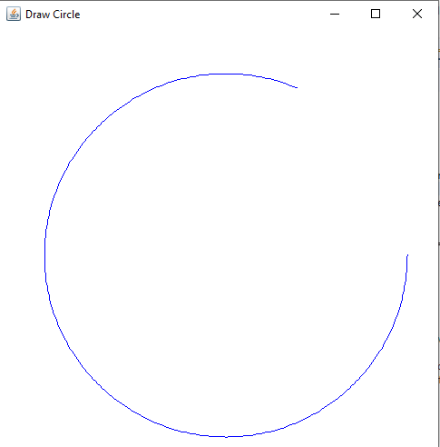

<h4>drawing circle using draw line and the math formula </h4>
<h5>Parametric form
The equation can be written in parametric form using the trigonometric functions sine and cosine as

    x = a + r cos ⁡ t , {\displaystyle x=a+r\,\cos t,\,} x=a+r\,\cos t,\,
    y = b + r sin ⁡ t {\displaystyle y=b+r\,\sin t\,} y = b+r\,\sin t\,</h5>
    
    
    

